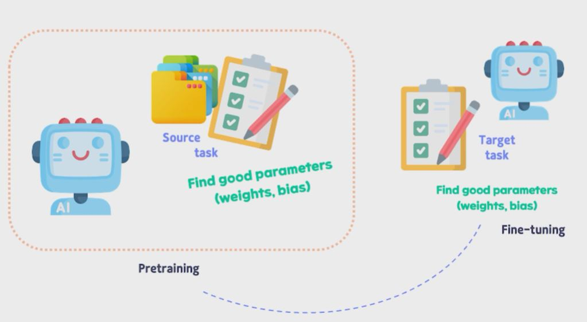
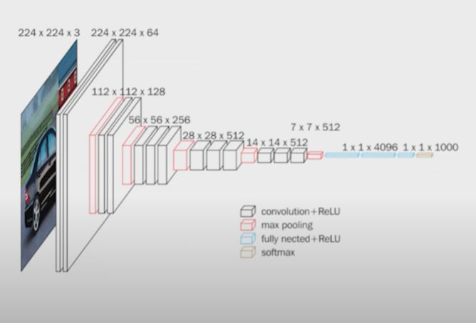

## 1. What is Transfer Learning?

## 2. Transfer Learning 장점

- Target task 데이터가 적을 때도 좋은 성능의 모델 빌딩 가능
- 자연어처리, 컴퓨터 비전 등의 과제에서 활용도 높음
- 모델 훈련 속도 매우 빠름
    - 이미 Source Task에서 최적화된 Parameter를 바탕으로 Target Task에 더 최적화된 Parameter를 찾아내기 때문

## 3. VGG16

- 옥스포드 대학 Visual Geometry Group (Computer Vision 그룹)
- CNN 기반 
- 모델 깊이 : 16 레이어
- ImageNet Dataset에 있는 100만 개 이상의 Image를 사용해서 모델 훈련
- Computer Vision, Object Detection 등의 과제에 많이 활용됨

